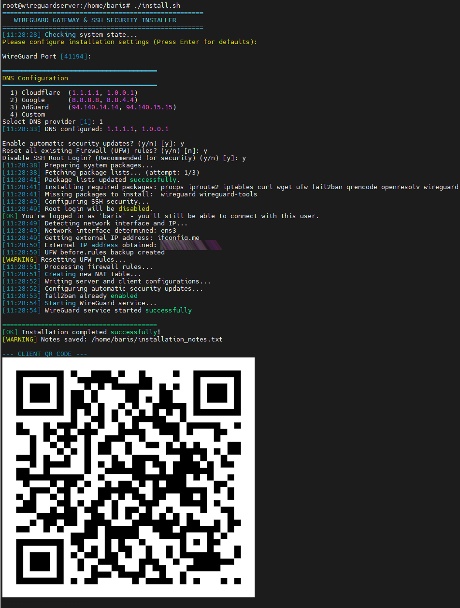

# 🛡️ WireGuard Secure Gateway

<div align="center">



**Ubuntu/Debian tabanlı sunucularda tek komutla WireGuard VPN ve SSH güvenlik kurulumu.**

[English](README.md) | [Türkçe](README_TR.md)

[](LICENSE)
[](install.sh)

</div>

---

## 📖 Bu Nedir?

Tek bir bash script ile yeni bir VPS veya sunucuyu dakikalar içinde **tam güvenlikli bir WireGuard VPN sunucusuna** dönüştürür. SSH güçlendirme, güvenlik duvarı kuralları, WireGuard anahtar üretimi, client yapılandırması ve mobil cihazlar için QR kod oluşturma — hepsini otomatik yapar.

> **Client gateway mı arıyorsunuz?** Tüm ev ağ trafiğinizi bu VPN üzerinden yönlendirmek istiyorsanız 👉 [wg-client-gateway](https://github.com/sinezty/wg-client-gateway)

## ✨ Özellikler

- 🔧 **Tek Komutla Kurulum** — Debian 11/12/13, Ubuntu 20.04/22.04/24.04+, Raspbian, DietPi tam otomatik
- 🔒 **SSH Güçlendirme** — Root giriş kontrolü, deneme sınırı, oturum zaman aşımı
- 🌐 **WireGuard VPN** — Otomatik anahtar üretimi, client config + QR kod
- 🧱 **Güvenlik Duvarı (UFW)** — Gelen trafik engelleme, akıllı NAT yönetimi
- 🛡️ **Fail2ban** — SSH brute-force koruması hazır gelir
- 🔄 **Otomatik Güncellemeler** — İsteğe bağlı güvenlik yaması güncellemeleri
- 🧹 **Temiz ve Kirli Kurulum** — Hem sıfır hem mevcut sistemlerde güvenle çalışır
- 🌍 **DNS Seçimi** — Cloudflare, Google, AdGuard veya özel DNS
- ⚠️ **Hata Yönetimi** — Rollback mekanizması, config yedekleri, tekrar deneme

## 🚀 Hızlı Başlangıç

> ⏱️ Kurulum yaklaşık **2–5 dakika** sürer.

```bash
curl -fsSL https://raw.githubusercontent.com/sinezty/wg-secure-gateway/main/install.sh | sudo bash
```

## 📦 Kurulum

```bash
# Yöntem 1: Doğrudan çalıştırma (önerilen)
curl -fsSL https://raw.githubusercontent.com/sinezty/wg-secure-gateway/main/install.sh | sudo bash

# Yöntem 2: İndirip çalıştırma
wget https://raw.githubusercontent.com/sinezty/wg-secure-gateway/main/install.sh
chmod +x install.sh
sudo ./install.sh
```

## ⚙️ Yapılandırma

Script interaktif olarak sizi yönlendirir:

| Ayar | Varsayılan | Açıklama |
|------|-----------|----------|
| WireGuard Port | 41194 | VPN tüneli için UDP portu |
| DNS Sağlayıcı | Cloudflare | VPN client'larının kullanacağı DNS (tablo aşağıda) |
| Otomatik Güncellemeler | Evet | unattended-upgrades ile güvenlik yamaları |
| UFW Sıfırlama | Hayır | Mevcut güvenlik duvarı kurallarını sıfırlama seçeneği |
| Root Girişi Kapatma | Evet | SSH root erişimini engeller (root iseniz otomatik atlanır) |

### DNS Sağlayıcıları

| # | Sağlayıcı | Birincil | İkincil |
|---|-----------|---------|---------|
| 1 | Cloudflare | `1.1.1.1` | `1.0.0.1` |
| 2 | Google | `8.8.8.8` | `8.8.4.4` |
| 3 | AdGuard | `94.140.14.14` | `94.140.15.15` |
| 4 | Özel | Kullanıcı tanımlı | Kullanıcı tanımlı |

## 📋 Kurulum Süreci

```
1. Sistem Kontrolleri    → Root yetki, OS sürümü, mevcut yapılandırmalar
2. Paket Yükleme        → WireGuard, UFW, fail2ban vb. (tekrar deneme ile)
3. SSH Güçlendirme      → Özel port, güvenlik sınırları
4. Ağ Algılama          → Arayüz, public IP (çoklu fallback)
5. WireGuard Kurulum    → Anahtar üretimi, sunucu ve client config
6. Güvenlik Duvarı      → UFW kuralları + NAT/MASQUERADE yönlendirme
7. Servisler            → fail2ban, WireGuard, otomatik güncellemeler
8. QR Kod               → Telefonunuzla taratarak bağlanın
```

## 📁 Oluşturulan Dosyalar

| Dosya | Ne işe yarar |
|-------|-------------|
| `/etc/wireguard/wg0.conf` | Sunucu yapılandırması |
| `/etc/wireguard/client.conf` | Client yapılandırması (bunu paylaşın!) |
| `/var/log/wg_setup.log` | Tam kurulum logu |
| `~/installation_notes.txt` | Bağlantı detayları ile özet |

## 🔐 Güvenlik Önlemleri

| Katman | Koruma |
|--------|--------|
| SSH | Maks 3 deneme, oturum zaman aşımı |
| SSH | Root girişi kapatılır (root iseniz korunur) |
| SSH | fail2ban brute-force koruması |
| Güvenlik Duvarı | UFW: tüm gelen engellenir, giden serbest |
| VPN | WireGuard tam şifreleme |
| Sistem | Otomatik güvenlik güncellemeleri (isteğe bağlı) |
| Yedekleme | UFW kuralları değişiklik öncesi yedeklenir |

## 💻 Gereksinimler

- **İşletim Sistemi**: Ubuntu 20.04+, Debian 11+, Raspbian veya DietPi
- **Erişim**: Root veya sudo yetkisi
- **Ağ**: Aktif internet bağlantısı

## 🔗 İlgili Projeler

| Proje | Açıklama |
|-------|----------|
| 👉 **[wg-client-gateway](https://github.com/sinezty/wg-client-gateway)** | Raspberry Pi'yi VPN ağ geçidine dönüştürün — tüm ev ağ trafiğinizi bu VPN sunucusu üzerinden yönlendirin |

## 🤝 Katkıda Bulunma

Pull request'ler memnuniyetle karşılanır. Büyük değişiklikler için lütfen önce issue açarak tartışalım.

## 📝 Lisans

MIT

## 👤 Yazar

BarışY